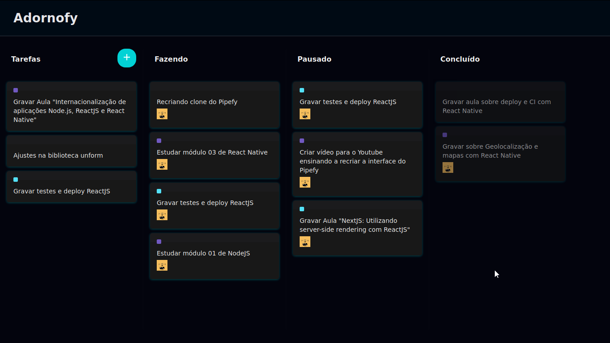

# Adornofy

## A Pipefy interface clone, with dark theme.

## ReactJS, React-DnD, Styled-Components

## Instructions
#### -Clone the project
#### -Execute your terminal on the project folder
#### -Insert the `npm i`
#### -To run, insert `npm run start`

